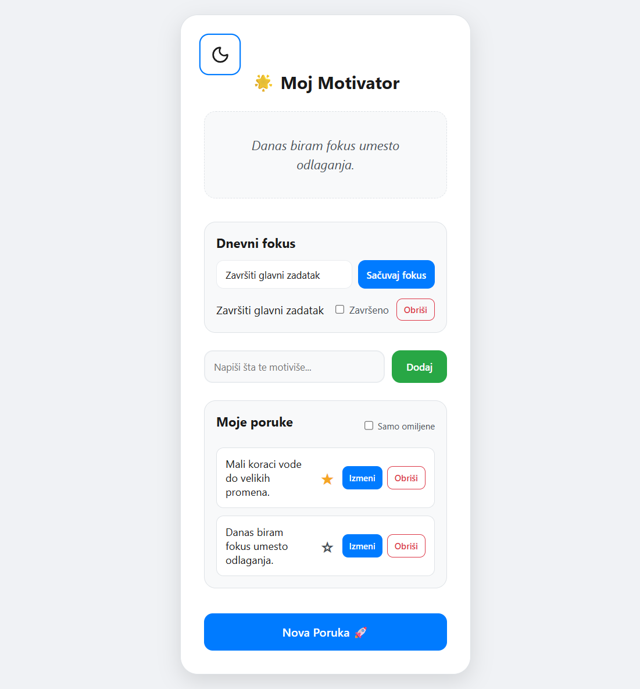
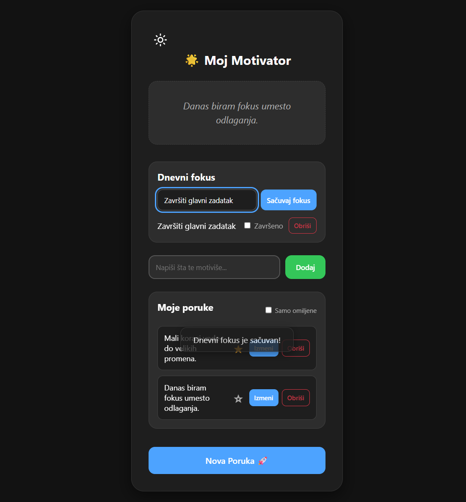

# 🌟 Moj Motivator

Moj Motivator is a browser-based tool for daily focus, personal motivational messages, and short self-reflection. It combines an inspiration generator with the ability to save, edit, delete, and favorite personal messages.

**Status:** Completed static front-end prototype. The application has no build process, backend, or user accounts.

The user interface and notifications are currently available in Serbian.

## 🎯 Why This Project

Moj Motivator was built as a focused personal productivity tool rather than a simple quote generator. It gives users one place to define a meaningful daily focus, collect messages that matter to them, and return to those messages without creating unnecessary complexity.

## 📸 Preview

|             Light Mode              |             Dark Mode             |
| :---------------------------------: | :-------------------------------: |
|  |  |

## ✨ Features

- **Daily Focus:** Save one focus for the current day, mark it as completed, edit it, or delete it.
- **Message Generator:** Display random motivational messages while avoiding immediate repetition.
- **Personal Messages:** Add, edit inline, and delete custom motivational messages.
- **Favorites:** Mark custom messages as favorites and filter the list to show favorites only.
- **Validation:** Reject empty, overlong, and duplicate messages.
- **Light/Dark Theme:** Persist the selected theme across page reloads.
- **Toast Notifications:** Provide non-blocking feedback for successful actions and errors.
- **Responsive UI:** Adapt the interface for desktop and smaller screens.
- **Accessibility Support:** Use semantic elements, live regions, `aria-pressed` state, explicit button types, and visible keyboard focus styles.
- **Defensive Storage Handling:** Centralize local and session storage access with safe JSON parsing and fallback behavior.

## 🛠️ Tech Stack

- **HTML5:** Semantic structure and accessible forms.
- **CSS3:** CSS custom properties for theming, responsive layout, and `:focus-visible` styles.
- **Vanilla JavaScript:** DOM interactions, validation, state management, and browser storage.
- **Lucide Icons:** Icons loaded through the CDN.
- **Jest:** Unit tests for the pure message-logic layer.

## 🧱 Project Structure

```text
moj-motivator/
├── index.html
├── css/style.css
├── js/main.js
├── js/message-logic.js
├── tests/message-logic.test.js
├── images/
├── light-screenshot.png
├── dark-screenshot.png
├── package.json
└── .gitignore
```

`message-logic.js` contains testable logic for message normalization, duplicate detection, and selecting the next message. `main.js` connects that logic to the DOM and manages the application state.

## ✅ Current Status

- [x] Daily Focus save, completion, edit, and delete flow
- [x] Persistent custom messages with inline edit and delete actions
- [x] Favorites and favorites-only filtering
- [x] No-repeat motivational message selection
- [x] Light/Dark theme persistence
- [x] Accessibility improvements and visible keyboard focus
- [x] Centralized browser storage and fallback handling
- [x] Jest unit tests for the message logic layer
- [x] Strict mode and deferred script loading

## 💡 What This Demonstrates

- Designing a small but complete client-side state model
- Building CRUD interactions with validation and persistence
- Separating pure application logic from DOM-specific code for testing
- Handling browser storage failures and malformed data safely
- Improving accessibility through semantic markup, ARIA state, live regions, and keyboard focus
- Maintaining a feature-oriented Git workflow with verified changes

## 🚀 Getting Started

1. Clone the repository.
2. Open `index.html` in a modern browser or use a local static server.
3. No build step is required to use the application.

Node.js is only required for running the test suite. Install the test dependencies and run Jest with:

```bash
npm install
npm test
```

## 🧪 Testing

Jest tests cover the pure application logic rather than the complete browser UI. The current suite checks:

- trimming and capitalizing valid messages
- rejecting empty messages
- enforcing the 150-character limit
- duplicate detection and edit exceptions
- selecting the next message without immediate repetition
- safe fallback behavior when only one message is available
- behavior for an empty message collection

Latest verified result:

```text
Test Suites: 1 passed, 1 total
Tests: 7 passed, 7 total
```

The main UI flows should also be checked manually in a browser, including Daily Focus, message edit/delete, the favorites filter, theme toggling, and the no-repeat generator.

## 🔒 Limitations

- The application is a static front-end project with no backend, database, or authentication layer.
- Messages, favorites, theme settings, daily focus, and the last displayed message are stored only in the user's browser storage.
- Data is not synchronized between devices or users.
- Lucide icons depend on CDN availability.
- Jest covers pure message logic; browser end-to-end tests are not currently included.
- The application is a daily focus and motivation tool, not psychological or medical advice.

## 👩‍🔬 Author

**Ivana Tatić**  
Master of Organic Chemistry and Web Developer
